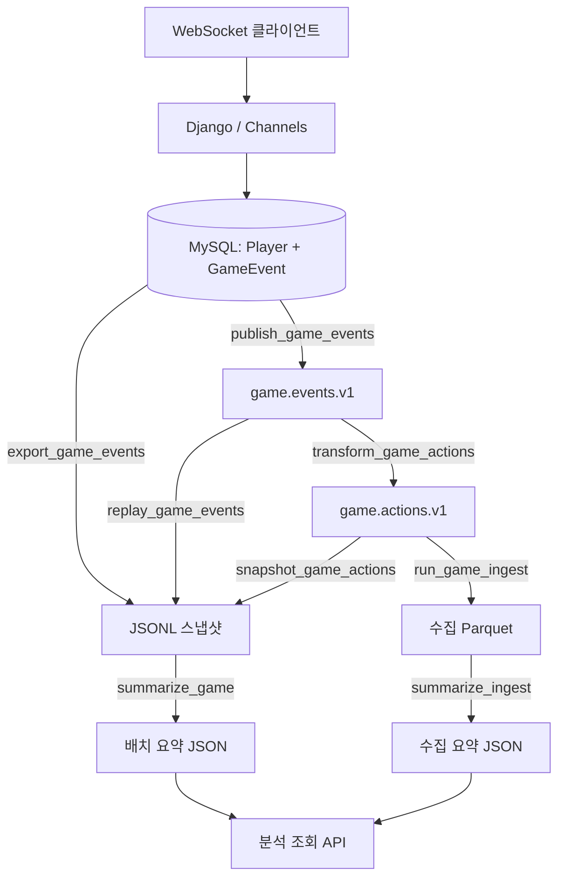

# Game Server

Django와 Channels로 구성한 수업용 게임 서버입니다. 세션 인증을 거친 WebSocket 명령으로 이동·채집·수련을 처리하고, 플레이어 상태와 확정 이벤트를 MySQL에 함께 저장합니다. 이벤트는 Kafka의 원본·행동 토픽을 거쳐 Spark 배치 집계, Parquet 수집, 시간 창 집계에 사용합니다.

## 현재 구현 상태

- 로그인·로그아웃, 내 상태·최근 이벤트·미발행 이벤트 수 조회
- WebSocket 초기 상태, 같은 방의 접속자 목록과 상태 변경 방송
- 플레이어 행 잠금과 트랜잭션을 통한 상태 변경 및 `GameEvent` 기록
- 플레이어별 `command_id` 중복 처리 방지, 연결별 0.2초 명령 간격 제한
- 이동·채집·수련 이벤트에 행동 전후 관측과 보상을 담은 `transition` 기록
- MySQL outbox 발행, Kafka 관찰·offset 조회·고정 구간 재읽기
- 행동 이벤트 필터링과 표시 이름 추가, 행동 토픽 스냅샷 및 집계 API
- Spark JSONL 배치 집계, Kafka → Parquet 수집, 수집 품질·중복 집계, 시간 창 집계
- 수동 행동 데이터를 JSONL로 내보내고 5단계 episode의 연결을 검사하는 도구

`/play/`는 사용자와 방 정보를 보여주는 준비 화면입니다. 지도와 이동·채집·수련 조작 UI는 아직 없으므로 게임 명령은 별도 WebSocket 클라이언트에서 전송합니다. `train`은 게임 안에서 코인을 얻는 수련 동작이며, 모델 학습을 실행하지 않습니다.



## 로컬 실행

아래 명령은 프로젝트 루트인 `game_server/`에서 실행합니다. Python 가상환경과 실행 중인 MySQL 서버, 데이터베이스 및 접근 계정이 필요합니다. 로컬 확인에 사용한 Python 버전은 3.12.10입니다.

HTTP/WebSocket 서버는 시작할 때 Kafka나 Spark에 연결하지 않습니다. 다만 Django 설정을 읽기 위해 `KAFKA_BOOTSTRAP_SERVERS`와 `SPARK_SUBMIT` 값은 필요합니다. Kafka·Spark 작업을 실행할 때는 해당 서비스도 별도로 준비해야 합니다.

### 1. 의존성 설치

```bash
python3 -m venv .venv
source .venv/bin/activate
python -m pip install -r requirements.txt
```

주요 의존성은 Django 5.2, Channels 4, Daphne 4, mysqlclient, kafka-python, python-dotenv입니다. 버전 범위는 [requirements.txt](requirements.txt)를 참고하세요. `mysqlclient` 설치 환경에 따라 MySQL 클라이언트 개발 라이브러리와 빌드 도구가 필요할 수 있습니다. Spark와 Java는 이 파일로 설치되지 않습니다.

### 2. 환경 변수 설정

MySQL 데이터베이스를 `utf8mb4` 문자 집합으로 준비하고 프로젝트 루트에 `.env`를 작성합니다. 기존 파일이 있다면 필요한 값만 수정합니다.

```dotenv
DB_NAME=game_server
DB_USER=game_user
DB_PASSWORD=replace_with_your_password
DB_HOST=127.0.0.1
DB_PORT=3306
KAFKA_BOOTSTRAP_SERVERS=127.0.0.1:9092
KAFKA_EVENT_TOPIC=game.events.v1
SPARK_SUBMIT=/absolute/path/to/spark/bin/spark-submit
SPARK_MASTER=spark://127.0.0.1:7077
```

| 변수 | 필수 여부·기본값 |
| --- | --- |
| `DB_NAME`, `DB_USER`, `DB_PASSWORD` | 필수 |
| `DB_HOST`, `DB_PORT` | 기본값 `127.0.0.1`, `3306` |
| `KAFKA_BOOTSTRAP_SERVERS` | 필수, 여러 broker는 쉼표로 구분 |
| `KAFKA_EVENT_TOPIC` | 기본값 `game.events.v1` |
| `SPARK_SUBMIT` | 필수, Spark 실행 시 실제 `spark-submit` 경로 사용 |
| `SPARK_MASTER` | 기본값 `spark://127.0.0.1:7077` |

`.env`는 Git 추적 대상에서 제외됩니다. `KAFKA_GROUP_ID`도 설정에 선언되어 있지만 현재 consumer 명령은 각 명령의 기본 group과 `--group` 옵션을 사용합니다.

### 3. 테이블 및 플레이어 생성

```bash
python manage.py migrate
python manage.py create_player --username player01 --room room-01
```

새 계정의 비밀번호는 터미널에서 입력합니다. `--room`을 생략하면 `room-01`을 사용합니다.

- 기존 사용자의 비밀번호와 플레이 상태를 유지합니다.
- 기존 플레이어에게 다른 `--room`을 지정해도 방을 변경하지 않습니다.
- 이 명령으로 방에 새 플레이어를 추가할 때는 방당 20명으로 제한합니다.

게임 접속 계정은 `create_player`로 준비해야 합니다. 일반 사용자나 슈퍼유저만 생성하면 게임에 필요한 `Player` 레코드가 없습니다.

### 4. 서버 시작

```bash
python manage.py runserver 127.0.0.1:8000
```

Daphne가 개발 서버를 제공하며 HTTP와 WebSocket을 함께 처리합니다. [로그인 화면](http://127.0.0.1:8000/accounts/login/)에서 생성한 계정으로 로그인하면 `/play/`로 이동합니다. 루트 경로 `/`에는 화면이 없습니다.

## HTTP API와 화면

| 경로 | 방식 | 동작 |
| --- | --- | --- |
| `/accounts/login/` | GET, POST | 로그인 화면 및 세션 생성 |
| `/accounts/logout/` | POST | 로그아웃, CSRF 토큰 필요 |
| `/play/` | GET | 로그인 후 사용자·방 정보 표시 |
| `/api/player/` | GET | 내 좌표·코인·version 조회 |
| `/api/delivery/` | GET | 내 전체 이벤트 수와 미발행 이벤트 수 조회 |
| `/api/history/` | GET | 내 최근 이벤트 최대 20건, 최신순 |
| `/api/analytics/` | GET | `../data/marts/game-summary.json` 조회 |
| `/api/analytics/actions/` | GET | `../data-replay/actions/`의 행동 스냅샷 manifest와 집계 조회 |
| `/api/analytics/ingest/` | GET | `../data/marts/stream-summary.json` 조회 |
| `/admin/` | HTTP | Django 관리자 사이트, 관리자 계정 별도 필요 |

게임·분석 조회에는 로그인이 필요합니다. 미인증 요청은 `/api/player/`, `/api/delivery/`, `/api/analytics/`, `/api/analytics/ingest/`에서 HTTP 401 JSON을 반환하며, `/play/`, `/api/history/`, `/api/analytics/actions/`에서는 로그인 화면으로 이동합니다.

분석 API는 파일에 저장된 전체 집계 결과를 읽습니다. 플레이어나 방별로 응답을 제한하지 않으며, 조회 요청이 Spark 작업을 실행하지도 않습니다. 집계 파일이 아직 없으면 `available: false`를 반환합니다. 수집 집계 파일을 읽거나 검증할 수 없으면 `/api/analytics/ingest/`는 HTTP 503과 `ingest_summary_unreadable`을 반환합니다.

## WebSocket 명령과 방송

로그인한 브라우저의 세션 쿠키로 `ws://127.0.0.1:8000/ws/play/`에 연결합니다. 미인증 연결은 `4401`, 같은 플레이어의 중복 연결은 `4409`로 종료합니다. 접속자 관리는 현재 서버 프로세스 안에서 이루어집니다.

- 연결 직후 본인의 `state`를 전송합니다.
- 같은 방의 접속·종료 시 온라인 플레이어 목록을 `{"type":"snapshot","players":[...]}` 형태로 방송합니다.
- 명령 처리에 성공하면 `command_id`가 포함된 `state`를 같은 방의 모든 접속자에게 방송합니다.
- 클라이언트는 `player_id`로 본인과 다른 플레이어의 상태를 구분해야 합니다.

각 명령의 `command_id`에는 UUID를 사용합니다. 새로운 동작에는 새 UUID를, 동일한 명령의 재전송에는 기존 UUID를 사용합니다. 이미 성공한 명령을 재전송하면 상태를 다시 변경하지 않고 플레이어의 현재 상태를 방송합니다.

### 이동·채집·수련

```json
{"type":"move","direction":"right","command_id":"8df0e267-682c-4c08-a681-791b13c0c324"}
```

```json
{"type":"gather","command_id":"e1d8ed45-c420-4d20-94d9-6a0d470f80ac"}
```

```json
{"type":"train","command_id":"a51c4aa4-bb80-42be-8a36-a2d35435b1f8"}
```

| 명령 | 조건과 결과 | 이벤트 유형 |
| --- | --- | --- |
| `move` | `up`, `down`, `left`, `right`로 한 칸 이동 | `player.moved` |
| `gather` | `(2, 2)`에서 코인 1 증가 | `player.gathered` |
| `train` | `(3, 2)`에서 코인 1 증가 | `player.trained` |

맵 범위는 `0 ≤ x < 20`, `0 ≤ y < 15`이며 초기 좌표는 `(0, 0)`입니다. 각 새 명령이 성공하면 `version`이 1 증가하고 `GameEvent`가 같은 트랜잭션에서 저장됩니다.

명령 성공 시 방송되는 상태 예시:

```json
{"player_id":1,"type":"state","room_id":"room-01","x":1,"y":0,"coins":0,"version":1,"command_id":"8df0e267-682c-4c08-a681-791b13c0c324"}
```

초기 연결과 HTTP 상태 조회 응답에는 `command_id`가 없습니다. 명령 오류는 요청한 연결에만 `type`, `code`, `command_id` 필드로 반환합니다. 주요 오류 코드는 `object_required`, `too_fast`, `invalid_direction`, `outside_map`, `not_at_gather_tile`, `not_at_train_tile`, `unknown_action`입니다. 같은 연결에서 0.2초보다 짧은 간격으로 명령을 보내면 `too_fast`가 반환되며 재전송도 이 제한을 적용받습니다.

## 이벤트와 transition

MySQL에서 내보내거나 원본 Kafka 토픽으로 발행하는 이벤트 envelope은 다음 형태입니다.

```json
{
  "schema_version": 1,
  "event_id": "aaaaaaaa-aaaa-4aaa-8aaa-aaaaaaaaaaaa",
  "event_type": "player.moved",
  "player_id": 1,
  "room_id": "room-01",
  "event_time": "2026-09-21T12:00:00+09:00",
  "payload": {
    "command_id": "8df0e267-682c-4c08-a681-791b13c0c324",
    "x": 1,
    "y": 0,
    "coins": 0,
    "version": 1,
    "transition": {
      "episode_id": "cccccccc-cccc-4ccc-8ccc-cccccccccccc",
      "step": 1,
      "observation": {"x": 0, "y": 0, "coins": 0},
      "action": {"type": "move", "direction": "right"},
      "reward": 0,
      "next_observation": {"x": 1, "y": 0, "coins": 0},
      "done": false,
      "terminated": false,
      "truncated": false,
      "policy_version": "manual-v1"
    }
  }
}
```

`event_time`에는 UTC offset을 포함합니다. Kafka key는 `player_id`를 문자열로 바꾼 UTF-8 bytes입니다.

`transition`은 플레이어별로 성공한 행동을 5건씩 묶습니다. `reward`는 행동 전후의 코인 차이로 이동은 0, 채집·수련은 1입니다. 5번째 행동에서 `done`과 `truncated`가 `true`가 되며 `terminated`는 항상 `false`입니다. 다음 성공 행동은 새 `episode_id`를 사용하고, 좌표와 코인은 이어집니다. 과거의 `transition` 없는 이벤트는 그대로 유지합니다.

## Kafka 이벤트 처리

접속 가능한 Kafka broker와 대상 토픽을 준비한 뒤 실행합니다. 기본 흐름은 `game.events.v1` → `game.actions.v1`입니다.

### 1. MySQL outbox 발행

```bash
# 미발행 이벤트를 최대 100건 처리하고 종료
python manage.py publish_game_events --once

# 별도 터미널에서 계속 발행
python manage.py publish_game_events --batch-size 100
```

`published_at`이 비어 있는 이벤트를 `event_time`, `event_id` 순으로 읽고, Kafka의 `acks=all` 응답 후에 `published_at`을 기록합니다. `--once`는 한 batch만 처리합니다.

### 2. 이벤트 관찰과 offset 확인

```bash
python manage.py watch_game_events --group village-watch-v1 --limit 10
python manage.py inspect_game_offsets --topic game.events.v1 --group village-watch-v1
```

`watch_game_events`는 이벤트 ID·유형·key·partition·offset을 출력하고 읽은 위치를 해당 group에 commit합니다. 플레이어 상태나 `GameEvent`는 변경하지 않습니다. `inspect_game_offsets`는 각 partition의 시작·끝·commit된 offset을 조회하며 commit하지 않습니다.

별도 분석 group에서 JSONL에 누적 저장하고, 저장 후 다음 offset을 commit하는 예시:

```bash
python manage.py consume_game_sample --group day13-analysis-a --limit 6 --output ../data/group-samples/a.jsonl
```

`consume_game_sample`의 group 이름은 `day13-analysis-`로 시작해야 합니다. `--limit`은 1~100, `--idle-seconds`는 1~60이며 기본값은 각각 6, 10입니다.

### 3. 행동 토픽으로 변환

```bash
python manage.py transform_game_actions
```

원본 이벤트를 검증하고 3종류의 게임 행동만 `game.actions.v1`로 발행합니다. `event_id`, `event_time`, `transition` 등 원본 필드와 Kafka key를 유지하며 `payload.action_label`을 추가합니다.

| 이벤트 유형 | 표시 이름 |
| --- | --- |
| `player.moved` | 이동 |
| `player.gathered` | 개인 채집 |
| `player.trained` | 개인 수련 |

consumer group은 `village-actions-v1`로 제한됩니다. 출력 ack 이후 입력 offset을 commit하며, 대상 외 이벤트는 출력 없이 commit합니다. `--output-topic`으로 출력 토픽을 바꿀 수 있지만, 후속 스냅샷·수집 명령은 `game.actions.v1`을 참조합니다.

`--max-events N`은 입력 처리 건수를 제한합니다. 기본값 0은 계속 실행합니다. 지정 건수에 도달할 때까지 새 이벤트를 기다리므로 중단할 때는 `Ctrl+C`를 사용합니다.

발행·변환은 DB와 Kafka 또는 입력·출력 처리를 각각 확정하므로 ack 직후 중단·재시작 시 같은 `event_id`가 중복 전달될 수 있습니다. 후속 배치·수집 집계는 `event_id` 기준으로 중복을 제거합니다.

## Spark 집계와 수집

Spark와 Java, 실행 중인 standalone cluster를 별도로 준비하고 `.env`의 `SPARK_SUBMIT`, `SPARK_MASTER`를 맞춥니다. 스트리밍 관리 명령의 Kafka connector는 `org.apache.spark:spark-sql-kafka-0-10_2.13:4.1.3`으로 고정되어 있으므로 이 지정에 맞는 Spark 환경을 사용합니다.

관리 명령은 현재 Python 실행 파일을 driver와 executor에 지정합니다. 입출력에 로컬 파일 경로를 사용하므로 worker에서도 같은 경로와 Python 환경에 접근할 수 있어야 합니다. 수집·수집 집계 명령은 `spark://`로 시작하는 master를 요구합니다.

기본 데이터 저장 위치는 이 저장소의 **상위 디렉터리**인 `../data/`입니다. 지원하는 명령에서 `--data-dir`로 변경할 수 있지만 HTTP API의 파일 조회 경로는 앞서 안내한 고정 경로를 사용합니다.

### MySQL 스냅샷 집계

```bash
python manage.py export_event_sample
python manage.py export_game_events
python manage.py summarize_game --source raw
```

- `export_event_sample`: 최신 1건을 `../data/samples/game-event.json`에 저장합니다. 이벤트가 없으면 오류가 발생합니다.
- `export_game_events`: 발행 여부에 관계없이 모든 이벤트를 `../data/raw/game-events.jsonl`에 저장하며 기존 스냅샷을 교체합니다.
- `summarize_game`: JSONL에서 `schema_version=1`이고 `event_id`가 있는 행을 ID별로 중복 제거한 뒤 유형·방별로 집계합니다. `../data/marts/game-summary.json`을 갱신하고 `/api/analytics/`에서 조회할 수 있습니다.

### Kafka 보존 구간 재읽기

```bash
python manage.py replay_game_events --output ../data-replay/raw/game-events.jsonl
python tools/check_replay_file.py
python manage.py summarize_game --source raw --data-dir ../data-replay
```

시작 시점의 partition별 `[beginning_offset, end_offset)`를 고정해 JSONL로 저장하며 consumer group의 위치를 변경하지 않습니다. `game-events.manifest.json`에 토픽·건수·읽은 범위를 기록합니다. 집계 결과는 `../data-replay/marts/game-summary.json`입니다.

출력은 `data-replay` 아래의 `game-events.jsonl`로 제한됩니다. 기존 출력·manifest·partial 파일이 있으면 중단하므로 새로 수집할 때는 새 하위 디렉터리를 사용합니다. `--max-records` 기본값은 100,000건, `--timeout-seconds`는 120초입니다. 미완료 `.partial` 파일은 집계 입력으로 사용하지 않습니다.

### 행동 토픽 스냅샷 집계

```bash
python manage.py snapshot_game_actions --output ../data-replay/actions/raw/game-events.jsonl
python tools/inspect_action_snapshot.py --input ../data-replay/actions/raw/game-events.jsonl
python manage.py summarize_game --source raw --data-dir ../data-replay/actions
```

`snapshot_game_actions`는 `game.actions.v1`을 대상으로 재읽기 명령과 같은 고정 범위·기존 파일 보호 규칙을 적용합니다. 검사 도구는 manifest와 건수·offset 범위의 일치, 중복 이벤트의 원본 내용, 표시 이름과 transition 포함 여부를 확인합니다.

`/api/analytics/actions/`는 이 고정 경로의 manifest와 집계에서 원본 레코드 수, partition 범위, 중복 제거 후 유형·방별 집계를 반환합니다. 표시 이름은 현재 `ACTION_LABELS`에서 붙입니다. 다른 경로에 저장한 스냅샷은 자동으로 표시되지 않습니다.

### Kafka → Parquet 수집과 집계

```bash
# 현재 수집할 수 있는 범위를 처리하고 종료
python manage.py run_game_ingest --mode available-now
python manage.py summarize_ingest
```

계속 수집할 때는 별도 터미널에서 실행합니다.

```bash
python manage.py run_game_ingest --mode continuous --max-offsets 1000 --trigger-seconds 5
```

| 출력 | 내용 |
| --- | --- |
| `../data/stream/game-actions-parquet/` | Kafka 위치·원문·이벤트 필드·`parse_status`를 담은 Parquet |
| `../data/checkpoints/game-ingest-v1/` | 수집 재개용 checkpoint |
| `../data/marts/ingest-progress.json` | 마지막으로 관찰한 완료 micro-batch의 진행 정보 |
| `../data/marts/stream-summary.json` | `summarize_ingest`가 만드는 전체 수집 데이터 집계 |

최초 실행은 `earliest`에서 읽고, 재실행은 같은 checkpoint를 이어갑니다. 원문과 Kafka 위치를 보존하며 레코드를 `valid`, `invalid`, `unsupported`로 분류합니다. 재개할 때는 출력과 checkpoint를 함께 유지합니다.

`summarize_ingest`는 정상 레코드를 `event_id`로 중복 제거해 전체·정상·불량·미지원·중복 건수와 유형·방별 집계를 갱신합니다. 수집 이후 API에 최신 결과를 반영하려면 집계를 다시 실행합니다. `ingest-progress.json`은 전체 이벤트 수를 나타내는 파일이 아닙니다.

`python manage.py capture_ingest_environment`는 설정 정보를 `../data/evidence/day15/environment.json`에 기록합니다. `summarize_ingest --event-id <UUID>`를 사용하면 지정 이벤트의 Kafka 위치·원문을 포함한 조회 결과도 `../data/evidence/day15/event-<UUID>.json`에 저장할 수 있습니다.

### 시간 창 집계

```bash
python manage.py run_game_windows --kind tumbling
```

`game.actions.v1`의 `event_time`을 기준으로 10초 tumbling window, 10초 watermark, 5초 처리 간격을 적용해 유형별 레코드 수를 집계합니다. 확정된 창을 `../data/lake/windows/tumbling/`에 Parquet으로 추가하고, `../data/checkpoints/windows/tumbling/`에 진행 상태를 저장합니다.

이 작업은 `event_id` 중복 제거를 수행하지 않아 전달된 레코드 수를 집계합니다. `--kind sliding`도 인자로 받지만 현재 작업 본체는 tumbling 창과 저장 경로로 고정되어 있습니다.

## transition 데이터 내보내기

```bash
python manage.py export_game_events
python tools/export_transitions.py --input ../data/raw/game-events.jsonl --output ../data/transitions/manual-v1.jsonl
```

`payload.transition`이 있는 이벤트에서 이벤트 식별 정보와 행동 전후 관측·행동·보상을 추출합니다. 과거의 transition 없는 이벤트는 제외하고 `event_id` 중복을 제거합니다. 보상과 코인 차이, step과 종료 플래그, 연속된 step의 관측 연결을 검증합니다.

출력 옆의 `manual-v1.manifest.json`에는 제외·중복 건수와 완전한 5단계 episode·부분 episode 수를 기록합니다. 부분 episode도 출력에 포함됩니다. 기존 출력은 덮어쓰지 않으므로 다시 내보낼 때는 새로운 파일명을 사용합니다. 모델 학습 과정은 포함하지 않습니다.

## 보조 도구

아래 도구도 `game_server/`에서 실행합니다. 인자가 있는 도구는 `python tools/<파일명>.py --help`로 상세 옵션을 확인할 수 있습니다.

| 파일 | 용도 |
| --- | --- |
| [check_action_handoff.py](tools/check_action_handoff.py) | `--source` 원본과 `--actions` 스냅샷을 `--event-id`로 비교하고 표시 이름 외 필드·key 보존 검사 |
| [inspect_action_snapshot.py](tools/inspect_action_snapshot.py) | `--input` 행동 스냅샷과 manifest 검사 |
| [export_transitions.py](tools/export_transitions.py) | `--input`에서 검증한 transition을 `--output`으로 추출 |
| [find_nifi_event.py](tools/find_nifi_event.py) | `--directory`의 NiFi 출력 JSON에서 `--event-id` 검색 |
| [check_replay_file.py](tools/check_replay_file.py) | `../data-replay/raw/game-events.jsonl`의 건수와 offset 범위 검사 |
| [check_game_event_jsonl.py](tools/check_game_event_jsonl.py) | 같은 재읽기 파일의 첫 이벤트 필드 확인 |
| [read_group_samples.py](tools/read_group_samples.py) | `../data/group-samples/a.jsonl`과 `b.jsonl`의 이벤트 ID 비교 |
| [check_encode_decode.py](tools/check_encode_decode.py) | DB 추출 파일의 첫 이벤트를 UTF-8/JSON으로 변환·복원해 원본과 비교 |

`check_encode_decode.py`는 Django 설정이 필요하므로 `python manage.py shell -c 'import tools.check_encode_decode'`로 실행합니다. NiFi 흐름 정의나 실행 설정은 이 저장소에 포함되어 있지 않습니다.

## 프로젝트 구조

```text
game_server/
  config/                       Django 설정, HTTP·ASGI 라우팅
  game/
    models.py                   Player, GameEvent
    services.py                 게임 명령, transition 기록, 이벤트 직렬화
    consumers.py                WebSocket 인증, 접속 관리, 방별 방송
    transforms.py               이벤트 검증 및 행동 표시 이름 부여
    views.py                    준비 화면, 상태·발행 현황·이력 API
    management/commands/        플레이어 생성, Kafka 처리, 내보내기
    templates/                  로그인·준비 화면
    migrations/                 DB 마이그레이션
    test_transforms.py          행동 변환 테스트
  analytics/
    views.py                    배치·행동 스냅샷 API
    ingest_views.py             수집 집계 API
    management/commands/        Spark 작업 실행, 환경 기록
    test_ingest_views.py        수집 집계 API 테스트
  spark_jobs/                   배치 집계, Parquet 수집, 수집 집계, 시간 창
  tools/                        JSONL 검사, transition 추출, 이벤트 비교
  manage.py                     Django 관리 명령
  requirements.txt              Python 의존성
data/                           기본 입력·출력·checkpoint (상위 디렉터리)
data-replay/                    Kafka 재읽기·행동 스냅샷 (상위 디렉터리)
```

## 점검 및 개발 범위

```bash
python manage.py check
python manage.py test
```

현재 테스트는 `game/test_transforms.py` 4건과 `analytics/test_ingest_views.py` 3건입니다. 행동 선별·원본 보존, 수집 집계 API의 인증·미생성·정상 조회를 검증하며 DB를 사용하지 않습니다. `game/tests.py`와 `analytics/tests.py`는 기본 골격만 있습니다. 게임 DB 갱신, WebSocket, Kafka, Spark를 연결한 통합 테스트는 포함하지 않습니다. `check`도 DB 연결이나 외부 서비스의 동작을 확인하지 않습니다.

현재 설정은 로컬 수업·개발용입니다. `DEBUG=True`, 전체 호스트 허용, 코드에 고정된 `SECRET_KEY`, 메모리 기반 채널 레이어와 접속자 사전을 사용합니다. 여러 서버 프로세스에서 운영하려면 채널 레이어와 접속자 관리를 공유해야 합니다. Kafka 발행·변환과 Spark 수집은 웹 서버와 별도 프로세스로 실행합니다.
